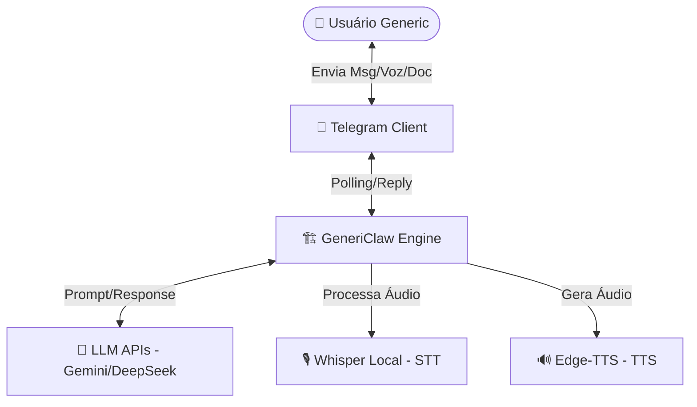
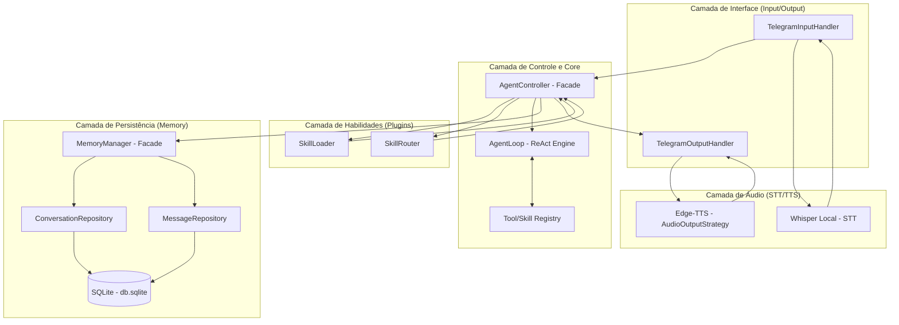
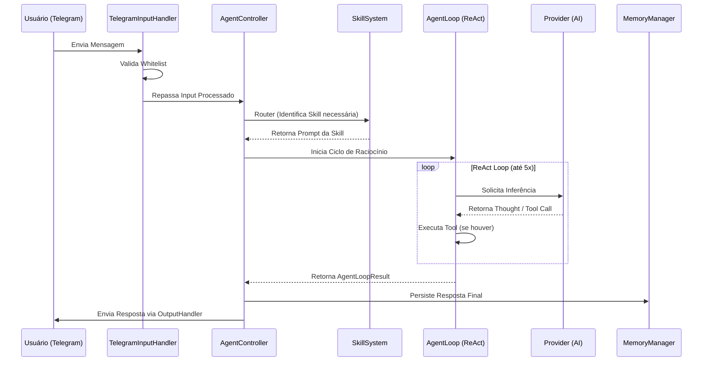

# Arquitetura do Projeto: GeneriClaw

---

## 1. Visão Geral

O **GeneriClaw** é um agente pessoal de Inteligência Artificial projetado para operar localmente no desktop do usuário. Sua interface primária de controle é o Telegram, permitindo uma interação fluida via texto, documentos e voz. O sistema é construído para ser modular, extensível através de "skills" (habilidades) e totalmente focado na privacidade, mantendo a persistência de dados localmente.

A arquitetura segue um fluxo de pipeline onde as mensagens do Telegram são capturadas, processadas por um motor de raciocínio (Agent Loop) que utiliza LLMs externos (como Gemini ou DeepSeek) apenas para inferência, e responde de volta ao usuário de forma inteligente, podendo inclusive gerar arquivos ou respostas em áudio.

---

## 2. Requisitos Arquiteturais

| Requisito | Tipo | Prioridade | Notas |
|-----------|------|------------|-------|
| Operação Local | Não-funcional | Crítica | O "core" deve rodar no host local (Windows). |
| Interface Telegram | Funcional | Alta | Uso da biblioteca `grammy` para polling. |
| Persistência Local | Funcional | Alta | Armazenamento de conversas em SQLite. |
| Padronização de LLMs | Não-funcional | Alta | Troca dinâmica de provedores (Gemini, DeepSeek, Groq). |
| Multimodalidade (Input) | Funcional | Média | Suporte a PDF e Voz (STT via Whisper Local). |
| Multimodalidade (Output)| Funcional | Média | Suporte a Arquivos (.md) e Voz (TTS). |
| Segurança de Acesso | Funcional | Crítica | Whitelist estrita baseada em ID de usuário do Telegram. |

---

## 3. Estilo Arquitetural

O sistema adota um estilo **Monolito Modular com Sistema de Plugins**.  
- **Monolito Modular:** Facilita o desenvolvimento e deploy local sem a complexidade de microsserviços.
- **Plugin-based (Skills):** Permite que novas funcionalidades sejam adicionadas ou atualizadas via "Hot-Reload" apenas manipulando diretórios na pasta `agents/skills`, sem reiniciar o processo principal.

**Trade-offs:**  
- **Vantagem:** Baixa latência interna, facilidade de manutenção para um único desenvolvedor, alta coesão.
- **Desvantagem:** Escalabilidade vertical limitada ao hardware do host local (não é um problema para o caso de uso de agente pessoal).

---

## 4. Diagrama de Contexto



---

## 5. Diagrama de Componentes e Camadas

O projeto segue estritamente a **Programação Orientada a Objetos (POO)** com separação clara de responsabilidades em arquivos e módulos distintos.



---

## 6. Decisões de Tecnologia (Source of Truth)

Este tópico centraliza as definições de stack. **Alterações aqui devem refletir mudanças em toda a arquitetura do sistema.**

| Componente | Tecnologia | Detalhes / Justificativa |
|------------|------------|-------------------------|
| **Linguagem** | **Node.js (TypeScript)** | Ambiente rátido para IO, ecossistema rico e familiaridade. |
| **Paradigma** | **Orientação a Objetos** | Uso obrigatório de Classes, Interfaces e Padrões de Projeto (User Rule). |
| **Banco de Dados**| **SQLite** | Local, serverless, rápido (`better-sqlite3`). |
| **Interface Bot** | **grammy** | Framework moderno e performático para Telegram Bot API. |
| **Raciocínio IA** | **ReAct Pattern** | Loop de "Thought -> Action -> Observation -> Answer". |
| **STT (Voz)** | **Whisper (Local)** | Transcrição privada sem custo de API. Binário `whisper` CLI invocado via `child_process.execFile`. Modelos multi-GB rodam em processo separado para não bloquear o event loop do Node. |
| **Conversão Áudio** | **ffmpeg (Obrigatório)** | Converte OGG/OPUS do Telegram para WAV mono 16kHz antes do Whisper. Verificado na inicialização. Se ausente, entrada de voz é desabilitada. |
| **TTS (Fala)** | **Edge-TTS** | Geração de voz de alta qualidade (`pt-BR-Thalita`). |
| **Parser Documentos**| **pdf-parse** | Extração de texto de PDFs para processamento pela IA. |

### Ciclo de Vida do Modelo Whisper

Modelos Whisper sao arquivos multi-GB (`ggml-*.bin`) armazenados em `./models/whisper/`. 

**Download inicial:** O modelo NAO e baixado automaticamente. O usuario deve executar um script de setup (ex: `npm run setup:whisper`) que baixa o modelo `ggml-small.bin` (ou o configurado em `WHISPER_MODEL`) para `./models/whisper/`. O download e unico e o arquivo persiste entre reinicializacoes.

**Tamanhos por modelo:**
| Modelo | Tamanho aprox. | RAM necessaria |
|--------|---------------|----------------|
| tiny | ~75 MB | ~1 GB |
| base | ~150 MB | ~1 GB |
| small | ~500 MB | ~2 GB |
| medium | ~1.5 GB | ~5 GB |
| large | ~3 GB | ~10 GB |

**Validacao na inicializacao:** O `WhisperProcessor.isAvailable()` verifica se o binario `whisper` (configurado em `WHISPER_BINARY`) existe no PATH e se o arquivo de modelo existe em `./models/whisper/`. Se o binario nao for encontrado, entrada de voz e desabilitada. Se o binario existir mas o modelo nao, o sistema loga warning: `[WhisperProcessor] Model file not found at ./models/whisper/ggml-small.bin. Run npm run setup:whisper to download.` e entrada de voz e desabilitada ate que o modelo seja instalado.

**Modelo corrompido:** Se o arquivo do modelo existir mas estiver truncado ou corrompido (hash SHA256 nao confere), o Whisper CLI falha na primeira transcricao. O `WhisperProcessor.transcribe()` captura o erro e notifica: "Modelo Whisper corrompido. Execute npm run setup:whisper novamente."

**Diretorio de modelos:** `./models/` e gitignored. Modelos sao compartilhados entre instalacoes do GeneriClaw na mesma maquina se o usuario criar um symlink para um diretorio central de modelos.

**Tempo de processamento vs timeout:** O tempo de transcricao escala com o tamanho do modelo e a duracao do audio. Estimativas para CPU moderna (sem GPU):
- small model: ~2x tempo real (audio de 30s processa em ~60s)
- medium model: ~4x tempo real (audio de 30s processa em ~120s)
- large model: ~8x tempo real (audio de 15s processa em ~120s)

O timeout de 60s definido em telegram-input.md EC-02 e suficiente para audios de ate ~30s com o modelo small. Usuarios de modelos medium/large ou audios longos devem esperar timeouts. Para mitigar: usar o modelo small (recomendado para MVP) ou aumentar `WHISPER_TIMEOUT_MS` no `.env`.

---

## 7. Design Patterns Utilizados

Para manter a alta coesão e baixo acoplamento, os seguintes padrões são aplicados:

1.  **Facade:** Utilizado no `AgentController` e `MemoryManager` para simplificar a interface com subsistemas complexos.
2.  **Factory:** `ProviderFactory` para instanciar diferentes provedores de LLM e `ToolFactory` para as ferramentas.
3.  **Repository:** Para abstrair o acesso ao banco de dados SQLite (`ConversationRepository`, `MessageRepository`).
4.  **Singleton:** Garantir instância única da conexão com o banco de dados.
5.  **Strategy:** No `TelegramOutputHandler` para decidir entre enviar texto puro, chunks ou arquivos.
6.  **Registry:** No sistema de Skills e Tools para registro dinâmico de capacidades.
7.  **Observer (EventEmitter):** No fluxo `userBlocked` entre `TelegramOutputHandler` e `AgentController`. O OutputHandler emite o evento quando detecta erro 403 "Forbidden" (usuario bloqueou o bot), e o AgentController escuta para chamar `MemoryManager.markConversationBlocked()`. Ver telegram-output.md EC-03 e agent-controller.md 6.2 step 14.

---

## 8. Fluxos Críticos (Sequence Diagram)

### Fluxo de Processamento de Mensagem


---

## 9. Infraestrutura e Deploy

- **Ambiente:** Execução direta no Windows via Terminal.
- **Process Management:** `npm run dev` (utilizando nodemon para hot-reload do core).
- **Diretórios de Dados:**
    - `./data/`: Banco de dados SQLite (`.db`).
    - `./tmp/`: Arquivos temporários (PDFs/Áudios) deletados após uso.
    - `agents/skills/`: Plugins de habilidades em Markdown.

---

## 10. Logging e Observabilidade

**Níveis de log:**
| Nível | Uso | Exemplo |
|-------|-----|---------|
| ERROR | Falhas que interrompem o pipeline (provider offline, DB corrompido). | `[AgentLoop] Provider failed: ECONNREFUSED` |
| WARN | Degradações não críticas (tool não encontrada, skill sem frontmatter, rate limit). | `[SkillLoader] Skill 'xyz' has no YAML frontmatter, skipping` |
| INFO | Transições de etapa no pipeline (início/fim de handle, skill selecionada, iteração concluída). | `[AgentController] input -> skill -> agent -> memory -> output` |
| DEBUG | Conteúdo de mensagens, tool arguments, respostas do LLM. | `[AgentLoop] Tool call: criar_arquivo { path: "output/prd.md" }` |

**Formato:** `[Módulo] Mensagem`. Sem timestamp explícito — o terminal adiciona via configuração do runtime.

**Destino:** `stdout` (console). Sem arquivo de log no MVP.

**Flag de controle:** `LOG_MESSAGE_CONTENT=false` (padrão). Quando `true`, mensagens de nível DEBUG são liberadas. O padrão é `false` para evitar expor conteúdo de conversas em logs visíveis em produção. Desenvolvedores devem optar ativamente por `true` quando precisarem de logs detalhados.


## 11. Riscos e Mitigações

| Risco | Impacto | Mitigação |
|-------|---------|-----------|
| Corrupção do SQLite | Alto | Uso de WAL (Write-Ahead Logging) e backups locais periódicos. |
| Falha na API de LLM | Alto | Implementação de `fallback` no `ProviderFactory`. |
| Vazamento de Memória (Node) | Médio | Gerenciamento estrito de Buffer de áudio e exclusão de arquivos TMP. |
| Estouro de Contexto IA | Médio | Truncamento nativo no `MemoryManager` via `MEMORY_WINDOW_SIZE`. |

---

## 12. Estrutura de Diretórios

```
genericlaw/
  src/
    config.ts       # Configuracao centralizada (AppConfig, validateConfig)
    core/           # AgentController, AgentLoop
    input/          # TelegramInputHandler
    output/         # TelegramOutputHandler, OutputStrategies
    memory/         # MemoryManager, ConversationRepository, MessageRepository
    providers/      # ILlmProvider, ProviderFactory, GeminiProvider, DeepSeekProvider
    skills/         # SkillLoader, SkillRouter
    tools/          # ITool, ToolRegistry, ToolFactory, BaseTool, implementacoes
  agents/
    skills/         # Plugins de habilidades (hot-reload, .md)
  data/             # SQLite .db (gitignored)
  tmp/              # Arquivos temporários (pdf, áudio)
  tests/
    unit/
    integration/
    mocks/         # MockLlmProvider, MockMemoryManager, MockGrammyContext
  specs/            # Documentação de especificação
```

**Estratégia de Testes:** A estratégia completa de testes e os contratos dos mocks estão definidos em `PRD.md` seção 13. Todos os módulos devem ser testados com os mocks ali especificados. Os mocks estão centralizados em `tests/mocks/` para reuso entre testes unitários e de integração.

---

## Gaps de Documentação (Observações)

Os seguintes elementos foram inferidos ou precisam de definição futura conforme o amadurecimento do código:

| Elemento | Status | Recomendação |
|----------|--------|--------------|
| Migrations de BD | Documentado | memory.md Seção 9 define estratégia MVP: recriar se schema inválido. Migrações incrementais na versão 2. |
| Rate Limiting Telegram | Confirmado | telegram-output.md EC-01 define retry com `Retry-After` header e sleep no OutputHandler ao receber erro 429. |
| Versão do Node.js | Inferido | Recomenda-se LTS (v20+) para estabilidade das bibliotecas nativas de FS. |
